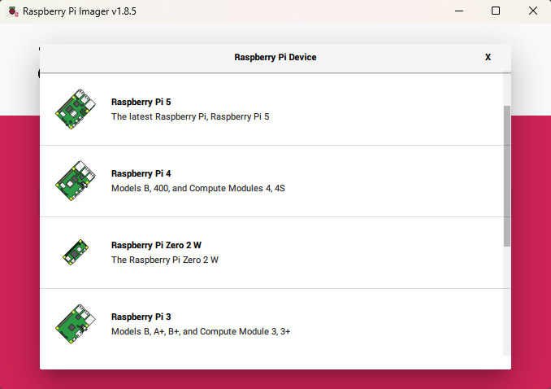

# Attendance System
This project is a simple attendance system which has a terminal to show who is marking an attendance entry upon tapping a card on a card reader. It uses a single Raspberry Pi and does the following:
- Display a digital clock
- Use Mifare RFID cards/tags to mark attendance upon entry and show nickname and full name
- Have a frontend for admin/management stuff: add and modify students, check attendance
- Connect both the terminal and the admin using a backend (API)

## Languages
- Frontend for Terminal: Python
- Frontend for Admin: SvelteKit (with Skeleton UI)
- Backend: PHP
- Database: MariaDB

## Requirements
- Raspberry Pi (tested with model 3B)
- ACR122U Mifare Card Reader
- 13.56 MHz Mifare cards or tags
- 16 GB SD Card
- Optionally a secondary (wired) network connection or by using a (USB) WiFi dongle. See #1 in [Network Setup](./README.md#network-setup).

## IMPORTANT: Security Notes
The current main branch of this project is meant to be used in a trusted network/environment. This project DOES NOT require authentication (yet) to gain access to the admin frontend. This means that anybody who knows that you have a system like this or knows the IP address of the Raspberry Pi could potentially gain access to the list of students in your database. Proceed with caution.

## Installation: Raspberry Pi OS
1. Get the Raspberry Pi Imager. https://www.raspberrypi.com/software/

2. Raspberry Pi Device: Download the Raspberry Pi OS for your device. 
3. Operating System: Select "Raspberry Pi OS (64-bit)".  32-bit will still work but this is just for futureproofing. You can also download your own Raspberry Pi OS and choose "Use custom" if the download option doesn't work. 
4. Storage: Select your SD Card, USB flash drive, or wherever you want to install the Raspberry Pi OS. 
5. OS Customizations: You may be prompted with "Would you like to apply OS customization settings?" I highly suggest for you to:
    - Enable "Configure wireless LAN" if you don't have a wired connection for it so it will have something to connect to on first boot.
    - If you plan to use FTP and/or SSH, set the username and password so you can access it.
    - Set locale settings.
    - Setting the hostname is optional if you want to access your device with a hostname instead of an IP address.
    - Enable SSH in the "SERVICES" tab if you are familiar with SSH. If not, you can use a keyboard and mouse to make your modifications on the Raspberry Pi.

6. After saving your customizations, you will be prompted to confirm formatting your device. Please make sure that you select your actual drive or just remove everything else before doing this. 
7. Once done, put your SD card or USB flash drive into your Raspberry Pi and let it boot and initialize.
8. Ensure that the Raspberry Pi is connected to a wired network or using a secondary (USB) WiFi adapter. See #2 in [Network Setup](./README.md#network-setup) and set a static IP for it.
9. Install the Attendance System package to your Raspberry Pi. (see below) [Installation: Attendance System Package](./README.md#installation-attendance-system-package)

## Installation: Attendance System Package
1. Install using Git
    1. Install git on the Raspberry Pi: Open the Terminal and do `sudo apt install git`.
    2. Go to your home directory: `cd ~`.
    2. Clone the package from GitHub: `git clone https://github.com/honganqi/Attendance-System.git`
    * You can also clone the package on a "main" computer where you can make your modifications and test your changes then get the files over to the Raspberry Pi with a storage device or FTP to transfer the files over the network. (see below)
2. Install by downloading the release as a ZIP file
    1. Go to your home directory: `cd ~`.
    2. Create a directory named "Attendance-System": `mkdir Attendance-System`
    3. Go into this directory: `cd Attendance-System`
    4. Get the latest release. Go to https://github.com/honganqi/Attendance-System/releases and copy the link of the ZIP file named "Attendance-System.something.something.zip" 
    5. Download the package ZIP file: `wget <put the link you copied here>`
    6. Unzip the ZIP file: `unzip <filename of the downloaded ZIP file>`
    7. Delete the ZIP file: `rm <filename of the downloaded ZIP file>`
    8. You can also install FTP and go from there. See [OPTIONAL: Install VSFTPd](./README.md#optional-install-vsftpd)
4. Run the installer `sudo install.sh`. See below [Installation: Package Dependencies](./README.md#installation-package-dependencies) for details on what it does. This is a multi-step process which took about 1 hour on my Raspberry Pi 3B.
5. Reboot the Raspberry Pi after installation is complete. You should see the terminal's clock window after rebooting.

## Installation: Package Dependencies
I have provided scripts assist in the installation but they are also detailed after this section.
1. Make the scripts executable: Open your Terminal, go to the Attendance-System directory with `cd Attendance-Terminal` if you're not in it yet, and type `chmod +x install.sh ./helpers/*.sh`.
2. `1-terminal_create_python_venv.sh` This script creates a Python virtual environment for the attendance terminal.
3. `2-terminal_install_reqs_in_venv.sh` This installs the dependencies of the Python terminal. I have also included a batch file version for Windows if testing is needed.
4. `3-docker_install.sh` Install Docker.
5. `4-docker_build_backend.sh` Build the backend image with Docker.
6. `5-docker_compose_dev.sh` This script starts the container without the admin frontend image. Intended to be used with `99-admin_dev_preview.sh` before building the admin frontend image.
7. `6-docker_build_admin_when_final.sh` This script builds the admin frontend image when customizations on the frontend are final.
8. `7-docker_compose_prod.sh` This starts the whole container ready for use.
9. `8-install_startup_when_ready.sh` After testing that everything works, install the startup scripts to enable the system for use upon boot. This set the "User" variable to the current user of the Raspberry Pi in the `/backend/config/docker.d/docker.attendancesystem.service` file. On my Raspberry Pi 3B, it takes 1.5 minutes for the boot sequence and Docker containers to be fully ready.
10. `9-reimport_database_for_changes.sh` If needed, re-import the database files. Alternatively, you can also do `docker volume -rm attendance-system_mysql_data -f` to remove them. Running the container again reinitializes the database if the volume doesn't exist.
11. `10-update_server_ip.sh` After getting and/or setting the IP address by connecting it to a network or by setting up a hotspot, set the static/permanent IP address or hostname of the Raspberry Pi using this script. See [Network Setup](./README.md#network-setup)
12. `99-admin_dev_preview.sh` This runs the SvelteKit admin frontend on development mode to allow you to test your changes in real time.
13. `99-docker_stop_containers.sh` This stops your containers. Frankly, all this does is `docker container stop` which is actually shorter than the script's file name so you can just type that.

## Network Setup
Several methods can be used to connect the attendance system to the network (listed from simplest to maybe most complicated):
1. Connect the Raspberry Pi to a wireless router where admin users are also connected. Give it a static IP.
2. In cases where the Raspberry Pi cannot be assigned a static IP (e.g. admin users do not have access to the router's management features), you can set up a wireless hotspot on the Raspberry Pi to allow it to have a static IP. A secondary connection will then be needed to sync the date and time on boot with:
    - Wired network
    - Secondary (USB) WiFi dongle

## Usage
1. Connect the ACR122U Mifare card reader to the Raspberry Pi.
2. Turn on the Raspberry Pi.
3. Wait for the server to be ready. It takes 1.5 minutes on my Raspberry Pi 3B.
4. Tap Mifare card on card reader.
5. If card is unassigned, get this number. You can click on the number to copy it.
6. Open the admin frontend site by going to `http://<server_ip>:3000` where "server_ip" is of course the IP address of the Raspberry Pi.
7. Go to "Students" > "Add Student" and fill out the form.
8. Click on the student's name again to edit the "ID Number".
9. Enter the number you got in #4.
10. Tap the card again to see the details.

## Test Mode
* You can enable the terminal's "test mode" by modifying `/terminal/terminal.ini` and setting the `TestMode` variable to `True` (or `False` to disable). Note the capitalized first letter. When enabled, the terminal will simulate the tapping of a Mifare card when the spacebar is pressed. This test will randomly pick from a list of 8 records without adding or modifying anything in the database.

## Notes
1. For the production build of the Admin Frontend to accept POST form submissions, an "ORIGIN" IP address or hostname needs to be set to solve the CORS (cross-origin resource sharing) issues. If the server's IP address and the URL of the remote user are different, the site will load but records cannot be changed (POST requests will fail). For example, if the address of the Raspberry Pi server is `raspberrypi.local` or `192.168.1.5` and it is being accessed through "http://localhost" even on the Raspberry Pi itself, you will encounter this issue.
2. For the Raspberry Pi to retain date and time information, it is necessary for the Raspberry Pi to be connected to a network with internet access on boot. It does not have a way to do this otherwise. Time will almost always be wrong after a few hours without power.
3. As of May 22, 2024, no authentication is implemented for the admin frontend. It is still a work in progress.
4. As of May 22, 2024, the attendance system terminal only shows the nickname and the full name of the student to keep this system simple for now. I have a template I use for my projects which includes showing the class name, the time of entry/exit, a log of all entries and exits, and a photo of the student. They're working but very conditional and circumstantial on the needs of the group. Let's... maybe discuss?
5. As of May 9, 2024, production build of the Admin Frontend needs to:
    1. use port 3000 or higher since port 80 and other lower number ports are reserved by the Linux system
    2. have the `ORIGIN` environment variable with the full URL pointing to the address (IP) where the system will be accessed with (e.g. http://raspberrypi.local:3000 or http://192.168.1.6:3000)

## OPTIONAL: Set up regular reboot
If you are planning to run the attendance system 24/7, I highly suggest rebooting everyday during non-peak hours.

Add cron entries
```bash
crontab -e
```
Cron Syntax:
- `* * * * * command arguments`
- `(minute) (hour) (day-of-month) (month) (day-of-week) command arguments`
- `*`	        any value
- `,`	        value list separator
- `-`	        range of values
- `/`	        step values
- `@yearly`	    (non-standard)
- `@annually`	(non-standard)
- `@monthly`	(non-standard)
- `@weekly`	    (non-standard)
- `@daily`	    (non-standard)
- `@hourly`	    (non-standard)
- `@reboot`	    (non-standard)

1. `reboot every 2:00 AM`
```bash
0 2 * * * sudo reboot
```

## OPTIONAL: Install VSFTPd
VSFTPd is an FTP server for Linux which allows file transfers using an FTP program like FileZilla.
- 
```bash
sudo apt install vsftpd -y
```
- Edit config file
```bash
sudo nano /etc/vsftpd.conf
```
- Comment out the following lines
```bash
#ssl_enable=NO
#local_enable=YES
```
- Add the following at the bottom and change "user_sub_token" to your Raspberry Pi user name
```bash
ssl_enable=YES
local_enable=YES
chroot_local_user=YES
user_sub_token=<username>
write_enable=YES
local_umask=0022
file_open_mode=0777
allow_writeable_chroot=YES
ftpd_banner=Welcome to the Attendance System FTP!
```
- Restart VSFTPd
```bash
systemctl restart vsftpd
```
